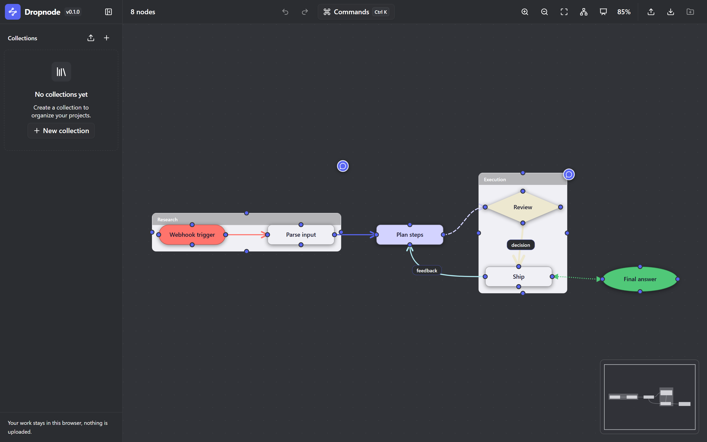
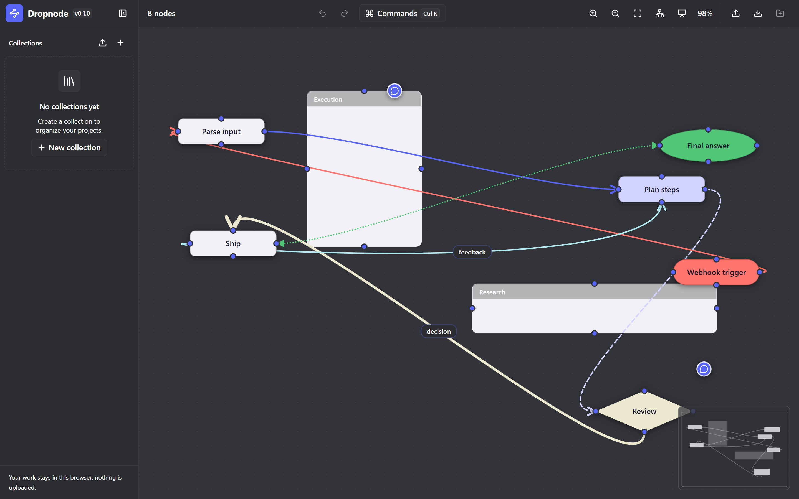
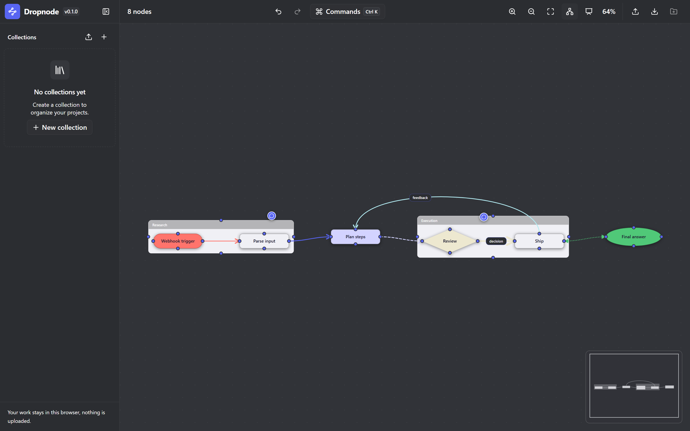
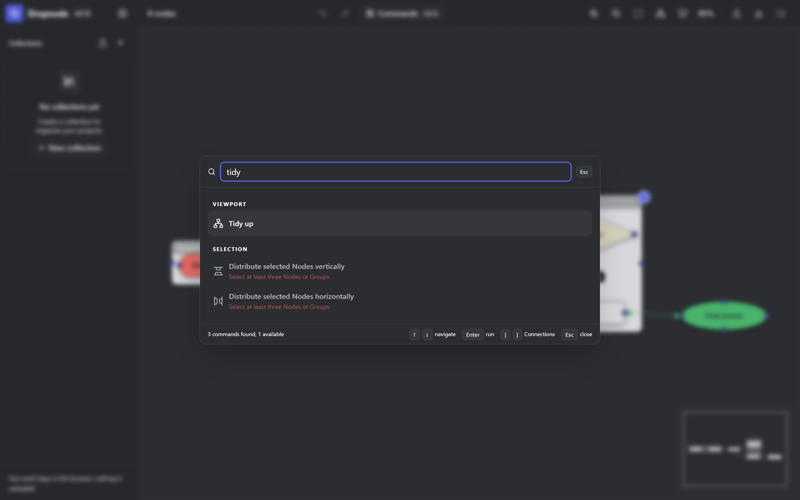
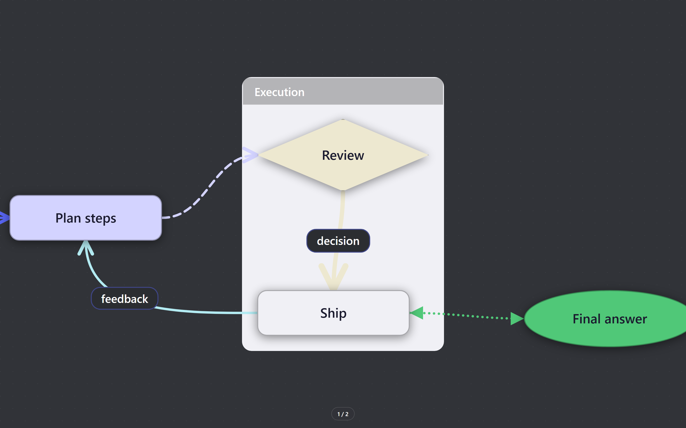

# dropnode

A fast, minimal, **local-first** node graph editor for the browser. Create nodes, wire them together with bezier connections, group and style them, lay them out, and share entire graphs as JSON — via file, clipboard, or a single URL. No accounts, no cloud, no tracking.



---

## Private by design — 100% local, zero data collection

This is a core design decision, not an afterthought:

- **No accounts, no signup, no cloud.** Everything — your Projects, Collections, graphs, viewport, and settings — is stored in your browser's `localStorage`. Nothing is ever uploaded anywhere.
- **Zero network requests.** The editor makes no calls to any server, analytics service, or telemetry endpoint. Once the page is loaded you can switch off your internet connection and keep working: editing, saving, and exporting all happen on your device.
- **No data collecting.** There is no tracking, no analytics, no fingerprinting, no ad SDKs, and no hidden beacons. Your graph is yours.
- **Sharing is just the URL.** A share link contains the graph itself, gzip-compressed and encoded into the link. Nothing is stored on a server — the data travels only where you send the link, and opening it imports a copy into the recipient's browser.
- **Exports are generated locally.** JSON and PNG exports are produced entirely in your browser, on your machine.

The honest trade-off: because there is no cloud, your graphs live in the browser storage of the device you used them on. Export to JSON to back up, and clear the browser's site data to wipe everything. That is what "no data collection" buys you.

---

## Features

### Nodes & editing

- **Create & rename** — double-click the canvas to create a node, double-click a node to edit its text inline. Nodes auto-size to their content.
- **Rich text** — nodes carry formatted text: **bold**, *italic*, highlights, links, font sizes (S/M/L), and bulleted lists, powered by ProseMirror under the hood.
- **Shapes** — a node can be a rectangle, pill, diamond, or ellipse — decision diamonds and terminator pills included.
- **Palette colors** — eight curated colors for node backgrounds and connection curves.
- **Resize & align** — drag corner grips to resize, with alignment guides that snap node edges and centers while dragging.

### Connections

- **Wire by drag** — drag from any of a node's four handles to another node; endpoints snap to nearby handles with a live dashed preview.
- **Quick-add** — drop a connection drag in empty space to spawn a new connected node on the spot.
- **Styled curves** — per-connection arrowheads (none / arrow / triangle), stroke patterns (solid / dashed / dotted), stroke weights (thin / normal / thick), and colors.
- **Connection text** — label a curve with formatted text, positioned anywhere along it.
- **Reroute points** — double-click a curve to bend it around obstacles; drag the points to reshape the route.

### Groups

- **Containers** — group related nodes; drag a group and its children move rigidly together.
- **One level deep by design** — a group holds regular nodes, never another group, and cannot be connected to its own children.

### Layout

- **Tidy up** — one click re-lays out the entire graph left-to-right following connection direction, re-picks handles to follow the flow, and re-anchors reroute points onto the new arrangement.

| Before | After |
| --- | --- |
|  |  |

- **Align & distribute** — six align commands (left / center / right / top / middle / bottom) and two distribute commands on any multi-selection.

### Navigation & viewport

- **Infinite canvas** — pan by holding Space and dragging (or middle-mouse / touch), zoom with the wheel (cursor-centered), and jump to the whole graph or a selection with `Shift+1` / `Shift+2`.
- **Minimap** — a corner overview of the whole graph with the current viewport outlined; click or drag it to move around.
- **Touch & pen** — one-finger pan and two-finger pinch zoom.

### Selection & editing workflows

- **Marquee & multi-select** — drag a rubber band (or `Shift`+click) to select many elements, then move, delete, or restyle them as one unit.
- **Clipboard** — cut, copy, paste, and duplicate selections (`Ctrl+X` / `Ctrl+C` / `Ctrl+V` / `Ctrl+D`).
- **Full undo/redo** — every action is an undoable command: create, move, rename, resize, style, connect, tidy. `Ctrl+Z` / `Ctrl+Shift+Z`.

### Projects, collections & present mode

- **Projects & Collections** — save graphs as named Projects inside Collections, auto-saved to your browser as you work (no save button; watch for the "Saving… / Saved" indicator).
- **Command palette** — `Ctrl+K` opens a fuzzy-searchable palette over every action: add node, tidy up, zoom, export, styling, toggles, and more.
- **Present mode** — walk a graph group-by-group as a full-screen viewport tour.





### Pins

- **Local markers** — drop single-user pins on the canvas or on a node to leave notes for yourself, toggleable in one click.

### Import & export

- **JSON** — download the graph as pretty-printed JSON, copy it to the clipboard, or import from a file or pasted text, with validate-then-replace safety (invalid payloads are rejected wholesale and leave your graph untouched).
- **PNG** — export the whole graph or a scoped selection as a 2× image, in a dark or light theme.
- **Shareable URLs** — copy a link with the entire graph compressed into it; open it anywhere and the graph loads instantly. Raw `?data=<json>` URLs work too.

### Performance & accessibility

- **Snappy at scale** — designed for graphs of ~200 nodes and ~100 connections with hybrid DOM/SVG rendering and `OnPush` change detection.
- **Keyboard-first** — every node, handle, connection, reroute point, and pin is keyboard-focusable and screen-reader named; arrows nudge, `Enter` activates, `Shift+F10` opens the context menu.

## Getting started

### Prerequisites

- [Node.js](https://nodejs.org/) 20+
- npm 11+

### Install & run

```bash
npm install
npm start
```

Open [http://localhost:4200](http://localhost:4200) in your browser.

### Build for production

```bash
npm run build
```

Build artifacts are emitted to `dist/`.

## Usage

| Action | How |
| --- | --- |
| Create node | Double-click empty canvas |
| Edit node text | Double-click node, type; `Enter` / blur commits, `Esc` cancels |
| Move node | Drag node (one undo step per drag) |
| Resize node | Drag a corner grip of the selected node |
| Select / multi-select | Click, `Shift`+click, or marquee-drag empty canvas |
| Delete selection | Select, then `Delete` or `Backspace` (removes connections too) |
| Connect nodes | Drag from a handle to another node's handle (snaps within range) |
| Quick-add node | Drop a connection drag in empty space |
| Add reroute point | Double-click the connection curve |
| Remove reroute point | Double-click the point |
| Label a connection | Select it, then edit its text card |
| Select connection | Click the connection curve |
| Group nodes | Drag nodes into a group, or right-click empty canvas → Add group |
| Create child in group | Double-click the group's body |
| Pan | Hold `Space` + drag, or middle-mouse drag (touch: one finger) |
| Zoom | Mouse wheel (cursor-centered), toolbar `+` / `−`, or pinch |
| Zoom to fit / selection | `Shift+1` / `Shift+2` |
| Minimap jump | Click or drag on the minimap |
| Command palette | `Ctrl+K` |
| Tidy up | Toolbar button, or `Ctrl+K` → "Tidy up" |
| Present | Toolbar Present button; `Esc` exits |
| Undo / Redo | `Ctrl+Z` / `Ctrl+Shift+Z` |
| Cut / Copy / Paste / Duplicate | `Ctrl+X` / `Ctrl+C` / `Ctrl+V` / `Ctrl+D` |
| Deselect | `Esc` |

## Graph JSON format

Exported and imported graphs share one schema — the complete serializable state: an array of **nodes**, an array of **connections**, and optionally an array of **pins**. This is the format behind every export, share link, and paste:

```json
{
  "nodes": [
    {
      "id": "n1",
      "text": [{ "kind": "paragraph", "runs": [{ "text": "Webhook trigger", "bold": true }] }],
      "shape": "pill",
      "color": "#FF746C",
      "x": 60, "y": 200, "width": 160, "height": 48,
      "parentId": "g1"
    },
    {
      "id": "g1",
      "kind": "group",
      "label": "Research",
      "x": 44, "y": 172, "width": 452, "height": 92
    }
  ],
  "connections": [
    {
      "id": "c1",
      "sourceNodeId": "n1",
      "sourceHandle": "right",
      "targetNodeId": "n2",
      "targetHandle": "left",
      "color": "#B3EBF2",
      "strokePattern": "dashed",
      "endArrowhead": "triangle",
      "text": [{ "kind": "paragraph", "runs": [{ "text": "feedback" }] }],
      "reroutePoints": [{ "x": 820, "y": 430 }, { "x": 700, "y": 430 }]
    }
  ],
  "pins": [
    { "id": "pin1", "anchor": { "kind": "canvas", "x": 500, "y": 60 }, "message": "TODO: add auth middleware" }
  ]
}
```

The full model is small by design — a curated set of fields, all optional unless noted. Imports are validated before anything is replaced: duplicate ids, connections referencing missing nodes, invalid handle values, off-palette colors, malformed text, or out-of-range reroute points reject the payload wholesale and leave the current graph untouched. A complete, working example lives in [`scripts/sample-graph.json`](./scripts/sample-graph.json) — load it with:

```
http://localhost:4200/?data=<url-encoded graph JSON>
```

## Graph prompting

Because a dropnode graph *is* plain, documented JSON, it doubles as a **graph prompt**: a structured representation an LLM can both read and write. Graph prompting — feeding a model a graph rather than prose — is an established technique for giving an LLM precise, relational context.

**Why dropnode graphs fit.** The schema is small enough to include in a prompt, self-contained (nodes + connections + pins, nothing else), and versioned — a model can generate it reliably, and the import validator will tell you immediately if it got a field wrong.

**Read: graph → LLM.** Export a graph (`Export as…` → JSON, or Copy JSON) and paste it into a conversation as structured context:

- Ask the model to **explain** the flow — "describe this pipeline in steps" — grounding the answer in your actual graph rather than a paraphrase.
- Ask it to **review or critique** — spot missing error handling, dead ends, or cycles.
- Ask it to **document** — turn the graph into prose, a checklist, or an architecture summary.
- For a coding agent, the graph JSON is a compact way to hand over "the shape of the system" in one message.

**Write: LLM → graph.** Give a model the schema and ask it to produce a graph:

```text
You are a graph designer for dropnode. Produce a JSON graph for a "webhook →
parse → plan → review → ship" workflow. Use pill shape for the trigger,
a diamond for the review decision, two groups ("Research", "Execution"),
dashed lines for feedback, and one pin noting an auth TODO.
```

Paste the model's JSON into the import dialog (or a `?data=` URL) and the graph renders — invalid fields are rejected with specific errors you can feed straight back to the model for a fix.

**Other possible usages:**

- **Workflow prototyping** — draft an automation pipeline as a graph, ask an LLM to extend it with edge cases, and iterate.
- **Prose → graph** — have an LLM convert a requirements document into graph JSON, then refine visually.
- **Round-tripping** — edit the JSON with a model (reorder, re-route, re-style), re-import, and compare.

One honest boundary: dropnode itself has no built-in AI. The graph is the interface — the model runs wherever you choose, and your data stays on your machine by default, consistent with the privacy section above.

## Architecture

- **Hybrid rendering** — nodes are DOM Angular components (easy text editing, accessibility); connections are a single SVG overlay (crisp beziers, cheap redraws). Both layers share one CSS `translate + scale` transform for pan/zoom (ADR-0001).
- **Signals as the single source of truth** — all graph state lives in `GraphService` signals; components mutate it only through the service.
- **Command pattern history** — undoable actions are `Command` objects with `execute()` / `undo()`, recorded by `HistoryService` on undo/redo stacks. Transient updates (mid-drag positions, auto-sizing) bypass history so a whole drag is one undo step.
- **Four handles per node** — one connection anchor per edge, positions derived from the node rect (ADR-0002).
- **Flat group model** — groups are nodes with a `kind`, holding children by `parentId` in one flat array with absolute coordinates (ADR-0004, ADR-0005).
- **LocalStorage-first persistence** — collections, projects, and settings persist in the browser under schema-versioned keys (ADR-0007).
- **Compressed share links** — gzip + base64url under a `gz:` prefix keeps graph URLs short (ADR-0026).
- **Performance budget** — `OnPush` change detection on the hot-path components (canvas, node, connection-layer), targeting 200 nodes / ~100 connections (ADR-0003).

```
src/app/
├── components/    # canvas, node, handle, connection-layer, toolbar, sidebar,
│                  # minimap, command-palette, text-editor, export-dialog,
│                  # import-dialog, connect-dialog, context-menu, toast, app-shell
├── directives/    # keyboard shortcuts
├── models/        # GraphNode, Connection, GraphState, Command, ViewportState, ...
└── services/      # GraphService, HistoryService, commands, collection,
                   # clipboard, export, presentation, url-loader, ...
```

## Testing

Unit tests run on [Vitest](https://vitest.dev/) with jsdom (870+ tests covering models, services, commands, and components):

```bash
npm test                                # run the suite
npx vitest run --coverage               # with coverage
```

## Tech stack

| | |
| --- | --- |
| Framework | [Angular 22](https://angular.dev/) (standalone components, signals) |
| Text editing | [ProseMirror](https://prosemirror.net/) (schema-locked, neutral wire format) |
| Styling | [Tailwind CSS 4](https://tailwindcss.com/) |
| UI primitives | [@spartan-ng/brain](https://spartan.ng/) |
| Testing | [Vitest](https://vitest.dev/) + jsdom, [Playwright](https://playwright.dev/) for browser automation |
| Tooling | Angular CLI, Prettier |

## License

Released under the [MIT License](./LICENSE). You are free to use, modify, and distribute dropnode — commercially or privately — provided the copyright notice and permission notice are preserved. Your graphs stay yours: the license covers the software, not your data.
